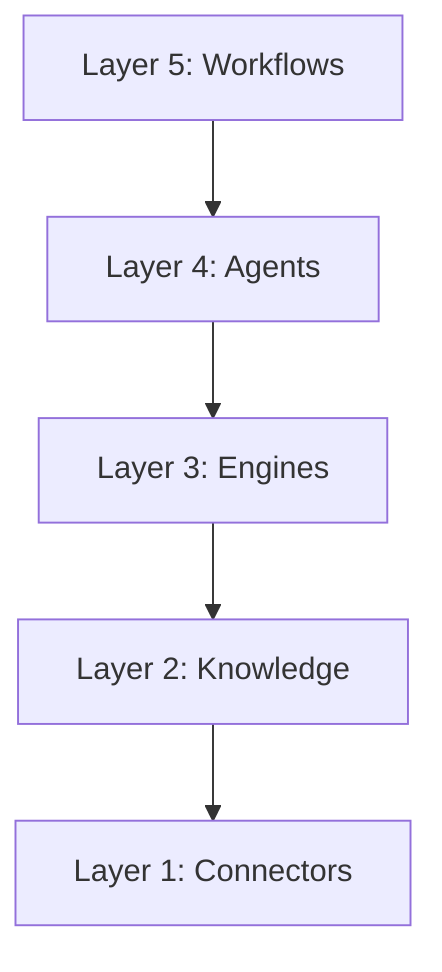

# Architecture Layers

A infraestrutura do Epic 03 é construída sobre 5 camadas estritas:

Regra de Ouro: Uma camada superior pode invocar uma inferior, mas NUNCA o contrário. Agentes (L4) orquestram Engines (L3), que consomem Knowledge (L2), que é alimentado por Connectors (L1).
