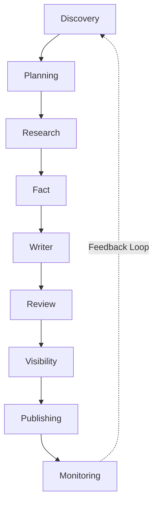

# Sprint 26.10 — Monitoring Agent V1

## O Que Foi Criado
O nono e definitivo agente do Organic Traffic OS: **Monitoring Agent**.
Ele representa a etapa de Pós-Publicação e é a peça chave que transforma o sistema de uma "fábrica de conteúdo linear" para um **Loop Infinito de Crescimento (Flywheel)**.

## O Que Ele Faz?
O agente consome o pacote de conteúdo publicado e o cruza com métricas e histórico (Mock Providers nesta fase). A partir disso, ele gera:
- **Trend Status**: Identifica se o artigo está em 'alta', 'queda' ou 'estabilidade'.
- **Health Score**: Avalia a saúde global cruzando performance, atualidade, engajamento e conversão.
- **Recomendações Práticas**: "Melhorar CTA", "Atualizar artigo", "Criar conteúdo satélite".

## O "Feedback Loop"
Se a inteligência do Monitoring Agent determinar que um artigo tracionou e precisa de textos de apoio (Cluster Expansion), ele **envia automaticamente essa sugestão para o Discovery Agent**.
Isso significa que o sucesso de um artigo gera a pauta do próximo artigo. O sistema alimenta a si mesmo.

## A Cadeia Total do Organic Traffic OS
A obra prima do Epic 03 está finalizada em seus fundamentos autônomos:

## Próximos Passos
Toda a base multi-agente está desenhada e validada tecnicamente (tipos fortes, manifestos, regras de transição).
O próximo grande movimento (Epic 04 / Orquestração) seria dar "vida própria" a isso tudo através de CRON Jobs, Redis Queues ou um **Workflow Agent** central que dispare a cadeia sem que o usuário aperte o botão "run" em cada etapa.
